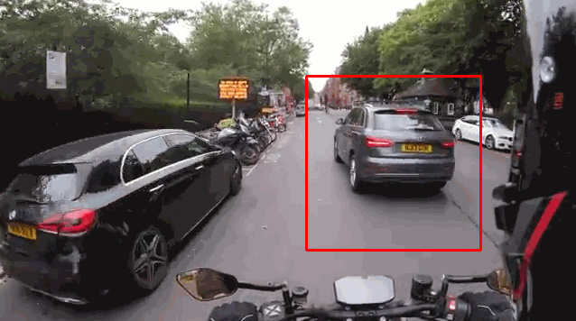

# Car-And-Pedestrian-Tracking-

Tracks cars and pedestrians within a video.

## Purpose

Learn the python opencv library.

## Functionailties

- Tracking cars and pedestrians in a video
- Locating cars within a photo.

## What I've learned

I learned:

- the basics of opencv
- how a search algorithm works in a photo
- how the datasets obtained from the study of many images are saved.

## How the project looks like

